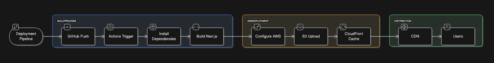

# Next.js 프론트엔드 배포 파이프라인

## 프로젝트 소개

이 프로젝트는 Next.js 애플리케이션을 AWS 클라우드 인프라를 활용하여 자동화된 배포 파이프라인을 구축한 것입니다. GitHub Actions를 통한 CI/CD 구현으로 효율적이고 안정적인 배포 프로세스를 확립했습니다.

## 배포 아키텍처


배포 파이프라인 다이어그램은 [Eraser.io](https://eraser.io)로 작성되었으며, 소스 코드는 `docs/deployment-diagram.er`에서 확인할 수 있습니다.

## 기술 스택

- **프레임워크**: Next.js 14
- **언어**: TypeScript
- **스타일링**: Tailwind CSS
- **배포 환경**: AWS (S3, CloudFront)
- **CI/CD**: GitHub Actions

## 배포 프로세스 개요

GitHub Actions 워크플로우를 통해 다음과 같이 자동화된 배포가 진행됩니다:

1. **소스 코드 체크아웃**

   - GitHub repository의 코드를 Actions runner로 가져옵니다.

2. **Node.js 환경 설정**

   - Node.js 18.x 버전을 설정하여 안정적인 빌드 환경을 구성합니다.

3. **의존성 설치**

   - `npm ci` 명령어로 프로젝트 의존성을 설치합니다.

4. **Next.js 프로젝트 빌드**

   - `next build` 명령어로 프로덕션 최적화된 빌드를 생성합니다.

5. **AWS 자격 증명 구성**

   - GitHub Secrets에 저장된 AWS 인증 정보를 사용합니다.
   - IAM 사용자 권한으로 안전하게 AWS 리소스에 접근합니다.

6. **S3 버킷 배포**

   - 빌드된 정적 파일을 S3 버킷에 업로드합니다.
   - `aws s3 sync` 명령어로 변경된 파일만 효율적으로 업로드합니다.

7. **CloudFront 캐시 무효화**
   - 새로운 배포 내용을 즉시 반영하기 위해 CDN 캐시를 초기화합니다.

## 인프라 구성 상세

### Amazon S3

- **버킷 설정**:
  - 정적 웹사이트 호스팅 활성화 (버킷 호스팅 타입)
  - 퍼블릭 액세스: 허용됨
- **버저닝**: 비활성화
- **암호화**: Amazon S3 관리형 키(SSE-S3)를 사용한 서버 측 암호화 적용

### Amazon CloudFront

- **원본 설정**: S3 버킷 연결
- **HTTP 지원**: HTTP/2, HTTP/1.1, HTTP/1.0
- **캐시 설정**:
  - 캐시 정책: Managed-CachingOptimized 사용
  - HTTP를 HTTPS로 리디렉션

## 주요 개념 설명

### GitHub Actions과 CI/CD

GitHub Actions를 통해 코드 변경사항을 자동으로 감지하고 배포를 진행합니다. 이를 통해 수동 배포 과정을 없애고 배포 과정의 일관성과 신뢰성을 확보했습니다.

### S3와 정적 웹 호스팅

Amazon S3는 확장성이 뛰어난 객체 스토리지 서비스로, 정적 웹사이트 호스팅 기능을 제공합니다. 빌드된 Next.js 애플리케이션의 정적 파일들을 저장하고 서비스합니다.

### CloudFront와 CDN

CloudFront는 AWS의 CDN 서비스로, 전 세계 엣지 로케이션을 통해 콘텐츠를 빠르게 전송합니다. SSL/TLS 인증서를 통한 보안 연결과 캐싱을 통한 성능 최적화를 제공합니다.

### 캐시 무효화(Cache Invalidation)

새로운 배포 시 CloudFront의 캐시를 무효화하여 사용자가 항상 최신 버전의 콘텐츠를 받을 수 있도록 보장합니다. 이는 `deployment.yml` 워크플로우의 마지막 단계에서 실행됩니다.

### Repository Secret과 환경 변수

민감한 정보인 AWS 인증 정보는 GitHub Repository Secrets에 안전하게 저장하여 관리합니다. 이를 통해 보안을 유지하면서도 CI/CD 파이프라인에서 필요한 인증을 수행할 수 있습니다.

## 보안 설정

### GitHub Secrets

필요한 환경 변수들을 GitHub Repository Secrets에 설정:

- `AWS_ACCESS_KEY_ID`
- `AWS_SECRET_ACCESS_KEY`
- `AWS_REGION`
- `S3_BUCKET_NAME`
- `CLOUDFRONT_DISTRIBUTION_ID`

### IAM 정책

배포에 사용되는 IAM 사용자에게 필요한 최소 권한만 부여:

```json
{
  "Version": "2012-10-17",
  "Statement": [
    {
      "Effect": "Allow",
      "Action": [
        "s3:PutObject",
        "s3:GetObject",
        "s3:ListBucket",
        "s3:DeleteObject",
        "cloudfront:CreateInvalidation"
      ],
      "Resource": [
        "arn:aws:s3:::${BUCKET_NAME}/",
        "arn:aws:cloudfront::${ACCOUNT_ID}:distribution/${DISTRIBUTION_ID}"
      ]
    }
  ]
}
```

## 모니터링 및 로깅

- **CloudWatch**: 접근 로그 및 오류 모니터링
- **S3 액세스 로깅**: 버킷 액세스 기록 저장
- **CloudFront 로깅**: CDN 접근 로그 분석

## 주요 링크

- S3 버킷 웹사이트 엔드포인트: http://seungwan.s3-website.ap-northeast-2.amazonaws.com
- CloudFront 배포 도메인: https://d2pf6x43p3m6rf.cloudfront.net

## 프로젝트 구조

```
project-root/
├── .github/
│ └── workflows/
│ └── deployment.yml # GitHub Actions 워크플로우
├── docs/
│ └── deployment-diagram.er # 배포 파이프라인 다이어그램
├── src/
│ ├── app/
│ │ ├── layout.tsx
│ │ └── page.tsx
│ └── components/
├── public/
└── README.md
```

## 로컬 개발 환경 설정

```bash
프로젝트 클론
git clone [repository-url]

의존성 설치
npm install

개발 서버 실행
npm run dev

프로덕션 빌드
npm run build
```

## 배포 히스토리

- 초기 배포: 2024.11.21
- 주요 업데이트:
  - CloudFront 캐시 설정 최적화 (2024.11.21)
  - GitHub Actions 워크플로우 개선 (2024.11.21)

## 향후 개선 계획

1. **Route53 도메인 연결**

   - 커스텀 도메인 설정
   - SSL 인증서 자동 갱신

2. **성능 최적화**

   - 이미지 최적화 파이프라인 구축
   - 정적 자산 압축 적용

3. **모니터링 강화**
   - CloudWatch 알람 설정
   - 슬랙 알림 연동

## 문제 해결 가이드

일반적인 문제 해결 방법:

1. **배포 실패 시**
   - GitHub Actions 로그 확인
   - AWS IAM 권한 검증
2. **캐시 문제 발생 시**
   - CloudFront 캐시 수동 무효화
   - 브라우저 캐시 확인

## 참고 문서

- [Next.js 공식 문서](https://nextjs.org/docs)
- [AWS S3 문서](https://docs.aws.amazon.com/s3)
- [CloudFront 개발자 가이드](https://docs.aws.amazon.com/cloudfront)
- [GitHub Actions 문서](https://docs.github.com/en/actions)
